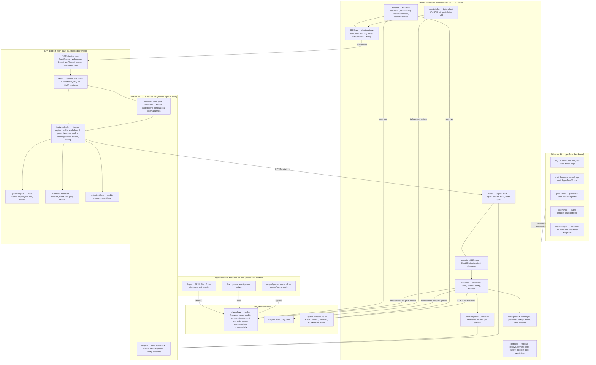
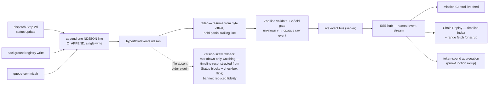

# hyperflow-dashboard — design spec

## Status

| Field       | Value                                                        |
|-------------|--------------------------------------------------------------|
| Status      | approved                                                     |
| Progress    | Section 5 / 5 approved                                       |
| Scope       | `dashboard/` subpackage · npm `hyperflow-dashboard` (bin) + 9 hyperflow-core files |
| Specialists | `architect, designer, motion · frontend-reviewer, accessibility-reviewer, api-reviewer, backend-reviewer, devops-reviewer, security-reviewer, vulnerability-reviewer` |
| Date        | 2026-07-12                                                   |

## TL;DR

An `npx`-launched, local-only cockpit for any project's `.hyperflow/` tree: live mission control over running chains, mind-map graphs of tasks and memory, per-plan conclusions, token analytics, and 8 novel insight features — plus full management writes (memory CRUD, config editing, markers, handoff actions) through five allowlisted write surfaces, wrapped in a dark-first anti-slop design system. The single most important design decision: shared Zod schemas are the only wire and parse contract — server parsers produce them, API routes validate against them, the client store consumes them — and all intelligence is pure-function derivation over that snapshot, with zero runtime LLM and zero external calls. The only change to hyperflow-core is additive: an `events.ndjson` append log emitted from `emit-event.sh` at three hook points; markdown artefacts stay authoritative.

## Components

- **CLI entry** (`src/cli/`) — arg parse, `.hyperflow/` root discovery, port select, session-token mint, browser open.
- **Hono server core** (`src/server/` — routes/services/parser/security/watch/sse) — loopback-only REST + SSE, defensive artefact parsers, path jail, atomic write pipeline, debounced watcher.
- **Shared Zod schemas + derived metrics** (`src/shared/`) — the single wire/parse contract plus pure-function health, leaderboard, conclusions, and token analytics.
- **React SPA** (`src/client/`) — 11 feature surfaces (mission, replay, health, leaderboard, plans, features, audits, memory, specs, tokens, config) over design-system primitives; prebuilt, shipped in the tarball.
- **hyperflow-core event emission** — `emit-event.sh` + 3 hook points (dispatch Step 2d, background registry writes, `queue-commit.sh`) appending to `events.ndjson`.
- **Test harness** (`tests/`) — golden artefact fixtures for parsers/metrics + Playwright e2e over the real server and watcher.

## 1. Architecture

### C4 context

One system (`hyperflow-dashboard`), one actor (the developer's browser on the same machine), three external surfaces: the project's `.hyperflow/` tree (+ `.hyperflow-handoff/` sibling), the user-global `~/.hyperflow/config.json`, and hyperflow-core's three NDJSON emit touchpoints (dispatch Step 2d status updates, background registry writes, `scripts/queue-commit.sh`). No network egress of any kind.

### C4 container + component graph



### Package layout (module granularity driven by the 300-line cap)

```
dashboard/
├── src/cli/        — entry, discovery, port, token, open (one module each)
├── src/server/
│   ├── routes/     — one file per resource (snapshot, memory, config, markers, handoff, events, stream)
│   ├── services/   — one file per domain service; routes never touch fs directly
│   ├── parser/     — one parser module per surface (tasks, features, memory, audits, specs, handoff, background, config, events)
│   ├── security/   — origin-allowlist, token, path-jail, denylist, secret-blocklist (one concern per file)
│   ├── watch/      — watcher, debounce/settle, integrity heuristic, events tailer
│   └── sse/        — hub, ring buffer, client registry
├── src/shared/     — Zod schemas + derived-metric pure functions (imported by server AND client)
├── src/client/     — features/ hooks/ stores/ lib/ per frontend standards
└── tests/fixtures/ — golden fixtures: real artefact samples per format variant
```

### Module boundaries — one-line contracts

| Boundary | Contract |
|---|---|
| CLI → server | CLI resolves `{rootDir, port, token, openBrowser}` and passes them as a typed options object; server never re-discovers. |
| routes → services | Routes do transport only (auth already passed, Zod-validated body in, Zod-serialized response out); services own all logic. |
| services → parser | Services hand absolute paths in-jail; parsers return `Parsed<T> \| RawFallback` (never throw on malformed artefacts). |
| parser → shared schemas | Every parser output type is `z.infer` of a shared schema — no parser-private shapes cross out of the layer. |
| services → write pipeline | The only write door: `writeFile(request)` runs path-jail realpath (+symlink deny) → denylist + secret blocklist on the resolved path → pre-write backup → temp+fsync → atomic rename; direct `fs` writes elsewhere are lint-banned. |
| write pipeline → path jail | Jail resolves realpath and denies symlink escapes; the denylist and secret blocklist are then checked against the RESOLVED path before any read/write. |
| watcher → SSE hub | Watcher emits settled, integrity-checked change sets; the hub is the sole assigner of event ids and the sole SSE writer. |
| events tailer → hub | Tailer emits Zod-validated event-line objects (or version-unknown raw events); never blocks on partial lines. |
| hub → SSE client | Named SSE events with monotonic `epoch-seq` ids; contract is replayable within the ring buffer window. |
| SSE client → store | Leader tab owns the single EventSource, rebroadcasts verbatim via BroadcastChannel; followers apply identical reducers. |
| store → selectors → UI | Components subscribe to memoized slice selectors only; UI-state changes (drawer, tab, filter) never re-render data lists. |
| client → server writes | All mutations go through TanStack Query mutations hitting `/api/v1` with the session token header; no other fetch paths. |
| shared/ → both sides | `shared/` imports nothing from server or client; both import from it — dependency arrows point inward only. |
| hyperflow-core → dashboard | Append-only `events.ndjson` lines (ADR-versioned public contract); core never calls the dashboard, dashboard never calls core. |

### Key structural decisions

- **State topology: Zustand + TanStack Query, split by push vs pull.** Zustand holds the push domain — the SSE-fed live snapshot, event feed, replay scrubber position, per-feature UI state — as separate slices so a marker toggle never re-renders the audit list. TanStack Query owns the pull domain — initial snapshot fetch, config reads, and every mutation (optimistic update + rollback + in-flight dedup). Zustand-only was considered and rejected: hand-rolling mutation lifecycle (retry, optimistic rollback, dedup) for memory CRUD + config editing + marker toggles + handoff transitions re-implements TanStack Query badly.
- **Derived intelligence lives in `shared/` as memoized pure functions** (Flow Health 0-100, Plan Conclusions, Leaderboard, Audit-trend heatmap, Token analytics). Client computes them via memoized selectors over the store snapshot; server stays a thin normalizer so SSE deltas stay small. Same functions unit-test against golden fixtures with no DOM and no server.
- **Parser layer is dual-format everywhere it matters:** status blocks as `| Field | Value |` tables AND plain `Key:` lines (the `/hyperflow:status` grep contract — `Sub-tasks:`, `Tokens used:`, `Wall-clock:`, `ETA:`, checkbox counts including `[~]`); task files in frontmatter shape AND terse roster shape; memory entries tagged AND legacy-untagged headings. Any parse failure degrades that artefact to a raw-markdown node with a `parseError` flag — the dashboard never blanks a panel because a Writer got creative.
- **Watcher strategy:** `fs.watch({recursive: true})` on the `.hyperflow/` root + `.hyperflow-handoff/` + `~/.hyperflow/config.json` (Node >=20 engines); chokidar fallback when recursive watch is unavailable or errors at runtime. Bursts (a dispatch batch ticking 3 checkboxes + Status block + commit) collapse behind a settle window; integrity heuristic (size-stable re-read + content checksum) suppresses no-op and mid-write events.
- **Code-split boundaries:** React Flow + elkjs (mission graph, memory knowledge-graph), Mermaid renderer, and the Chain Replay scrubber are each lazy route-level chunks — the Mission Control landing chunk carries none of the three heavy engines.
- **Virtualization:** audit findings, memory entries, and the live event feed are windowed lists; the event feed additionally caps in-store retention with on-demand range fetch from `/api/v1/events` for the scrubber.
- **Write surface is a closed enumeration:** memory CRUD, schema-validated config editing (validated against `config/schema.json` via a shared Zod mirror), `.mode`/`.sticky` marker toggles, handoff STATUS transitions (state-machine-checked: planned → built → reviewed only). Derived files (`memory/index.md`, `memory/.checksums`) are hard read-only; task files (`tasks/`, `features/*/tasks/`, `phase.md` rosters) are NEVER dashboard-written — both enforced in the write pipeline denylist, not in UI affordances alone.
- **Coding floor:** max 300 lines per source file (the layout above is sized for it), no `any` anywhere, exported APIs fully typed, shared Zod schemas as the single source of truth for wire AND parse types.

## 2. Data flow

### (a) Read path — fs change to pixels

```mermaid
graph LR
  EV["fs event burst<br/>(.hyperflow/ or handoff or config)"] --> DB["debounce/settle window<br/>coalesce per-path"]
  DB --> IH["integrity heuristic<br/>size-stable re-read + checksum vs cache"]
  IH -->|changed| PR["dual-format parse<br/>table OR key-line OR frontmatter"]
  IH -->|no-op / mid-write| DROP["suppress"]
  PR -->|ok| NS["normalized snapshot patch<br/>(shared Zod types)"]
  PR -->|malformed| RAWF["raw-markdown fallback node<br/>+ parseError flag"]
  NS --> DIFFP["snapshot diff → typed delta"]
  RAWF --> DIFFP
  DIFFP --> HUB["SSE hub — assign epoch-seq id,<br/>push to ring buffer"]
  HUB --> LT["leader tab EventSource"]
  LT --> BC["BroadcastChannel fan-out<br/>to all tabs"]
  BC --> ZS["Zustand slice reducer<br/>applies delta"]
  ZS --> MS["memoized derived-metric selectors<br/>(health, leaderboard, tokens…)"]
  MS --> UI["feature UI re-render<br/>(affected slice subscribers only)"]
```



Startup variant: SPA boots → TanStack Query fetches `GET /api/v1/snapshot` (full normalized snapshot + current epoch + last event id) → hydrates Zustand → EventSource subscribes from that id. Deltas arriving during hydration are buffered by the SSE client and applied after, in id order.

### (b) Write path — UI action to confirmed state

```mermaid
graph LR
  A["UI action<br/>(memory edit, config save,<br/>marker toggle, handoff transition)"] --> MQ["TanStack Query mutation<br/>optimistic slice patch + dedup"]
  MQ --> P["POST /api/v1/… + token header"]
  P --> SEC["security middleware<br/>Host/Origin allowlist + token check"]
  SEC --> ZV["Zod body validate<br/>(shared schema; config validated<br/>against schema.json mirror)"]
  ZV --> PJ["path jail — realpath resolve,<br/>symlink deny"]
  PJ --> DL["denylist + secret blocklist<br/>on resolved path — derived files,<br/>task files, out-of-enumeration<br/>targets → 403"]
  DL --> BK["pre-write backup<br/>timestamped copy"]
  BK --> TW["temp write + fsync"]
  TW --> AR["atomic rename over target"]
  AR --> WC["watcher observes the change<br/>(same read path as external edits)"]
  WC --> EC["SSE echo delta carrying writeId"]
  EC --> RC["store reconcile —<br/>optimistic entry → confirmed"]
  DL -->|denied| ER["4xx + typed error"]
  ER --> RB["mutation rollback of optimistic patch"]
```



The watcher echo — not the POST response — is the source of truth for confirmed state; the POST response only acknowledges acceptance. `writeId` correlation lets the client distinguish its own echo from concurrent external edits; handoff STATUS transitions are additionally gated by the server-side state machine (illegal transition → 409, no write, no backup).

### (c) Events path — NDJSON append to Mission Control



Truncation/rotation detection: if the file shrinks below the stored offset, the tailer re-reads from zero and emits a `resync` event so replay indexes rebuild. Emission is additive-only and ADR-governed: hyperflow-core only ever appends new event `type`s or optional fields; the dashboard treats unknown types/fields as displayable-raw, never as errors.

### SSE reconnect / resync

- Every SSE event carries id `"<epoch>-<seq>"` — `epoch` is minted per server process start, `seq` is monotonic. The hub keeps a bounded ring buffer of recent deltas.
- On reconnect the browser sends `Last-Event-ID`. Same epoch AND seq within the buffer → hub replays the missed deltas in order; cheap resume.
- Epoch mismatch (server restarted) or seq fallen out of the buffer → hub sends a `resync-required` event; client re-fetches `GET /api/v1/snapshot`, resets slices, resubscribes from the new id. Multi-tab: only the leader tab reconnects; followers receive the same replayed/resynced sequence via BroadcastChannel. Leader death (tab close) triggers re-election and a fresh `Last-Event-ID` resume from the last id any tab applied.
- Heartbeat comment frames on an interval let the client detect dead connections behind the OS socket timeout.

### ADR flags

Hard-to-reverse choices §3 must record as decisions:

- **events.ndjson line schema + versioning** — one JSON object per line `{v, ts, chain, skill, type, batch?, task?, status?, agent?, tokens?, detail?}`, the `v` integer gate, additive-only evolution rules, and the emit contract for the three hyperflow-core touchpoints. Public cross-repo contract; hardest to reverse.
- **HTTP API shape `/api/v1`** — resource naming, error envelope, token transport (header name), and the versioned prefix commitment.
- **SSE event names + id scheme** — named event vocabulary (`snapshot-delta`, `hf-event`, `write-echo`, `resync-required`, heartbeat), `epoch-seq` id format, ring-buffer replay semantics.
- **URL scheme** — SPA route map (`/mission`, `/replay`, `/health`, `/leaderboard`, `/plans`, `/features`, `/audits`, `/memory`, `/specs`, `/tokens`, `/config`), history-mode routing with server-side index fallback, token-in-fragment bootstrap handshake.
- **shared/ schema package boundary** — Zod schemas + derived pure functions as the single wire+parse truth, inward-only dependency rule, and whether `shared/` ships as an internal folder or a published sub-path export.
- **Write-surface enumeration + denylist placement** — the closed write list and the pipeline-level (not UI-level) enforcement of derived-file/task-file read-only status.
- **Watcher engine + settle policy** — fs.watch-recursive-first with chokidar fallback and the debounce/integrity heuristics that all delta semantics depend on.

## 3. Key decisions

### 3A. Design language & experiential decisions

> Binds `.hyperflow/design/system.md` (living design system) — every value below names a token from it; no inline values are legal downstream.

#### Pole execution

Dark-first mission control, executed as: flat blue-cast near-black elevation (`surface-0…3`, hairline separation, `shadow-pop` only on floating layers — no gradient, echoing Posh/Vercel restraint, deliberately flattening the brand `bg_start→bg_end` gradient), ONE accent (`accent` teal `#14B8A6`, echoing the brand `worker` color — the dashboard watches workers work; brand violet rejected at 3.4:1 contrast + anti-slop floor), and dense-but-calm data typography (IBM Plex Sans for UI at `type-ui/title/section`, IBM Plex Mono for every number and stream at `type-data/numeral/hero`; 28px dense rows inside instruments, `sp-5` calm between them). Semantic state colors (`state-pass/fix/blocked/live/queued`) appear only on state indicators, always paired with a text label. Reference basis: Posh stat cards + Vercel analytics restraint (URLs in system.md References).

#### Signature — the Chainline

One monospace stage-strip component is the product's spine and recognizability: hairline rail, stage ticks, `type-micro` labels, `type-data` per-stage token-cost sub-line, a single `accent` `scaleX` fill. Three modes, one component: **live** (Mission Control header — stage advances in real time), **scrub** (Chain Replay — the same strip is the draggable timeline with `r-full` playhead), **record** (frozen provenance header on audit/spec/feature views — click a stage to jump the inspector). Grounded in Replit's stage chips + n8n's executions rail; the divergence is fusing indicator, scrubber, and provenance into one navigable instrument. Functional, never decorative.

#### Per-feature experiential decisions

| Surface | Decision | Grounding + tokens |
|---|---|---|
| Mission Control | Feels like a flight deck holding steady, not a feed scrolling past: cockpit-trio layout (dispatch board primary + 360px inspector + collapsible bottom stream), fixed-height 28px `type-data` stream rows, chips flip in place with zero layout shift (`min-width` in `ch`, `motion-flip` cross-fade), in-flight shown by a 1px determinate `scaleX` hairline in `state-live` — never a pulse or glow | Databricks trio; system.md Motion §Live-data patterns (SSE chip flip, Stream entry); `surface-1`, `hairline`, `state-*` |
| Dispatch board rows | Agent lanes read as an instrument roster: `type-ui` agent name, stage chip, live cost in `type-data`, one row per worker; selection = `accent-dim` fill + 2px `accent` inset, inspector follows selection (`motion-panel` + `spring-instrument`) | Roster row + inspector components |
| Plan/spec/audit browsers | Browser-split grammar: 280px timestamped artefact rail + document pane; checkbox rosters render at default 36px rows; verdict tables use status badges (`state-*` `-dim` fill + label); Mermaid renders on `surface-1` with hairline frame | n8n rail; `type-body`, `r-2` |
| Mind-maps (memory graph, task DAG) | Reads like a schematic, not a bubble chart: typed `surface-2` node cards (`r-2`, `hairline-strong`) with `type-micro` type tags, port dots, and a `type-data` cost chip footer ("12.4k tok"); elkjs auto-layout, minimap, Runway-style floating bottom toolbar; a graph↔table toggle (Clay) is both the density valve and the keyboard/screen-reader path; edges are 1px `hairline-strong`, relationship strength by edge weight steps, never color rainbow | Clay + WRITER + Runway; node card component |
| Chain Replay | Scrubbing is direct manipulation: playhead tracks the pointer 1:1 with zero smoothing; a global `scrubbing` flag zeroes every duration so the whole board **snaps** to the scrubbed instant (no ghost transitions through intermediate states); on release the playhead settles to the nearest event boundary via `spring-settle`, inheriting pointer velocity; arrow keys step events, Shift-arrow steps stages; left history rail lists prior runs | n8n executions rail; Motion §Live-data patterns (Scrubber); Chainline scrub mode |
| Flow Health score | One `type-hero` numeral centered in a 120px masked-arc dial (`hairline` track, `accent` sweep re-coloring via `state-*` thresholds); a single `motion-sweep` pass on load or change, zero overshoot — the score is a reading, not a reward | Score dial component; Posh big numerals |
| Agent Leaderboard | Ranked count-bar table (`type-data` label + right-aligned mono value + proportional `accent-dim` bar) — explicitly not a podium, not donuts | Vercel count-bar tables |
| Token analytics | Numbers presented as instrument readings: `type-numeral` mono with unit suffix (`tok`), deltas as `type-data` badges in `state-pass`/`state-blocked`; NumberFlow tweens only user-salient low-frequency values (batch totals, Flow Health) — anything updating faster than its animation duration snaps; stat-tile row over single-hue chart cards, LangSmith-style Cost & Tokens tab grouping | Motion §Live-data patterns (Numerals); Posh/Vercel/LangSmith/Clay |
| Audit-trend heatmap | 5-step `accent` alpha ramp on `r-1` cells, values via hover popover (never printed in-cell, never hue-only — popover is the a11y path); cell change is a `motion-flip` cross-fade, no stagger wave | Heatmap cell component |
| Spec-diff viewer | `type-data` panes, add/remove at 10% `state-pass`/`state-blocked` fill + full-strength gutter markers; expand/collapse snaps layout and reveals via `clip-path` + `motion-enter` fade | Diff pane; Motion §Compositor budget (expand/collapse) |
| Memory/config/markers | Browser-split with roster rows; destructive actions (prune, clear) confirm inline in the inspector, `state-blocked` label — no modal theater | Roster row, inspector |
| Empty states | Fact + action in `type-body` `text-mid`, centered in the instrument's own frame ("No chains recorded. Run /hyperflow:plan in this project to populate.") — no illustrations | Empty state component |

#### Motion language (condensed — full spec in system.md §Motion language)

Principle: **instruments settle, they never perform.** Libraries: CSS transitions on the hot SSE path; **Motion for React** (v12, MIT) for panels, node enter/exit, scrub-settle; **React Flow built-in** viewport animation fed our durations (never double-animated); **NumberFlow** (MIT) for numerals. GSAP evaluated and rejected (imperative timelines vs SSE-driven React reconciliation). Tokens: `motion-flip` 120ms · `motion-enter` 200ms · `motion-panel` 280ms · `motion-sweep` 450ms · `ease-out` `cubic-bezier(0.25,1,0.5,1)` · `ease-exit-in` · `spring-settle` (300/30/1, playhead only — the one bounce) · `spring-instrument` (260/34/1, critically damped — data never bounces). Budget: `transform`/`opacity` only; banned: height/width/top/left/margin animation (fills use `scaleX`, reveals use `clip-path`, shifts use FLIP); `will-change` on exactly one element (inspector); stream entries coalesce per 100ms, stagger cap 3 × 25ms, >5 rows/s trips a snap-append circuit breaker. Reduced motion: all decorative motion off, functional feedback becomes instant (chips swap, numerals snap, graph durations 0); 1:1 scrubber drag stays (user-driven); runtime `matchMedia` listener via `MotionConfig reducedMotion="user"` + shared hook zeroing duration tokens.

#### Trade-offs accepted

- Brand violet and brand background gradient dropped in-dashboard (contrast + anti-goal) — brand continuity carried by the blue-cast surface hue and the teal/amber/red role echoes instead.
- Donut/pie charts banned even where "share of spend" tempts one — count-bar tables carry the same reading with rankable precision (Vercel precedent).
- Graph canvases accept an extra build cost (table-view toggle) as the non-negotiable keyboard/screen-reader path.
- Scrubbed replay never animates through intermediate states — replay fidelity beats visual continuity.

### 3B. Technical key decisions

**1. Subpackage `dashboard/` publishing the npm bin `hyperflow-dashboard`**
- **Decision:** The dashboard lives as a self-contained subpackage at `dashboard/` inside the hyperflow repo, published to npm as `hyperflow-dashboard` with a single `bin` entry, launched via `npx hyperflow-dashboard`. The plugin itself stays git/marketplace-distributed and never gains an npm dependency on the dashboard.
- **Why:** The root package name `hyperflow` is already taken on the npm registry, and the root `package.json` (currently v5.9.0, no `bin`) exists only as plugin metadata — it is not a publishable artefact. A subpackage keeps the plugin's zero-install-footprint story intact while giving the dashboard a real registry identity and independent publish cadence.
- **Release integration:** `scripts/bump-version.sh` (today: 11 files) is extended with one more sync target — `dashboard/package.json` — so repo-wide version bumps keep the dashboard's declared compatibility floor honest; actual dashboard releases are cut independently (`npm publish` from `dashboard/`, only when explicitly invoked per the security blocklist). `scripts/validate-plugin.py` gains an explicit ignore for `dashboard/` so its skills/features-parity and README checks never trip over a directory that contains no skills.
- **Trade-offs:** Accepted: two version streams to reason about, a second publish pipeline, and a slightly heavier monorepo. Rejected: separate repo (loses golden fixtures co-located with the artefact formats they pin, doubles release ceremony) and publishing under the root package (name unavailable, couples plugin releases to npm).

**2. Hono on `node:http`, bound to 127.0.0.1, SSE instead of WebSocket**
- **Decision:** The server is Hono running on the `node:http` adapter, listening only on 127.0.0.1. Live updates go over Server-Sent Events; the SPA shares one `EventSource` across tabs via `BroadcastChannel`.
- **Why:** Hono is dependency-light and typed end-to-end, unlike Express (legacy middleware weight) or Fastify (larger dependency tree for a tool whose cold-start is the product). Loopback-only binding is the first wall of the security model — the dashboard is a local cockpit, never a network service. SSE gives ordered one-way delta delivery with built-in auto-reconnect and `Last-Event-ID` resume for free, with zero extra dependency; the dashboard has no client→server streaming need that would justify a `ws` dependency. The HTTP/1.1 ~6-connections-per-origin cap is neutralized by electing one tab as the EventSource holder and fanning deltas out through `BroadcastChannel`.
- **Trade-offs:** Accepted: one-way push only (writes go over plain POST), and a leader-tab election edge case when the holding tab closes (re-elect, resume via `Last-Event-ID`). Rejected: WebSockets (bidirectional capability the product does not use, plus a reconnect protocol to hand-roll) and HTTP/2 (needless TLS/cert ceremony on loopback).

**3. Watcher: recursive `node:fs.watch` with a chokidar fallback and settle discipline**
- **Decision:** Primary file watching uses `node:fs.watch` with `recursive: true` under `engines: { node: ">=20" }`. At startup the server probes whether recursive watching actually works on the running platform (Linux support landed late and unevenly); on probe failure it transparently swaps in chokidar. All raw events pass through a 150 ms debounce, a write-settle wait, and an integrity heuristic (size/mtime stability) before the artefact is re-read in full.
- **Why:** Chain runs produce bursts of partial writes (task files updated per sub-task, dispatch status blocks rewritten mid-batch). Reacting per-event would parse torn files; the settle-then-re-read contract guarantees the parser only ever sees complete documents. Native `fs.watch` keeps the default dependency footprint at zero; the probe-based fallback buys Linux correctness without penalizing macOS/Windows.
- **Trade-offs:** Accepted: up to ~150–300 ms of visible latency between a file write and the UI delta, and chokidar sitting in `dependencies` even on platforms that never load it. Rejected: polling (CPU cost proportional to tree size, worst-case latency) and chokidar-always (unnecessary dependency weight on the majority platform).

**4. One shared dual-format defensive parser with a degrade-to-raw contract**
- **Decision:** A single parser module handles every artefact shape the doctrine produces: `| Field | Value |` markdown status tables, plain `Key:` lines, and the task-tracking YAML-frontmatter shape. Each artefact type carries golden fixtures; the parser's contract is parse-or-degrade — it never throws, unknown lines pass through untouched, and an unparseable document renders as raw markdown with a "degraded" badge rather than an error state.
- **Why:** Artefact formats are produced by skills, not by a serializer — they drift, and older projects hold older shapes. One module means one place where format knowledge lives and one fixture suite pinning it. The degrade contract makes the dashboard safe to point at any `.hyperflow/` tree, including half-migrated or hand-edited ones.
- **Trade-offs:** Accepted: the parser is the highest-maintenance module in the codebase and every format evolution in the plugin requires a fixture addition here. Rejected: per-view ad-hoc parsing (guaranteed divergence) and strict-schema rejection of malformed artefacts (turns real-world trees into error walls).

**5. Shared Zod schemas in `shared/` as the single source of truth, versioned API under `/api/v1`**
- **Decision:** Artefact shapes, derived-metric shapes, and the wire contract are Zod schemas in a `shared/` package imported by both the Hono server and the SPA; TypeScript types are inferred from them, never written twice. The HTTP surface is explicitly versioned under `/api/v1`.
- **Why:** Runtime validation at the server boundary and compile-time types in the client from one definition eliminates the classic drift between "what the server sends" and "what the client believes". Explicit versioning makes contract breaks a deliberate, visible act instead of an accident — important once events.ndjson consumers other than the dashboard exist.
- **Trade-offs:** Accepted: Zod in the client bundle (mitigated by tree-shaking and code-splitting) and a build-order constraint (shared builds first). Rejected: OpenAPI-generated clients (codegen pipeline weight for a two-sided contract owned by one repo) and duplicate hand-written types (the exact failure mode this prevents).

**6. `events.ndjson` emission: additive-only schema, ADR-gated evolution, markdown-only degradation**
- **Decision:** Core hyperflow emits an append-only `.hyperflow/events.ndjson`, one JSON object per line, shaped as `{v:1, ts, chain, skill, type, batch?, task?, status?, agent?, tokens?, detail?}`. Versioning rule: the `v` field marks the schema generation, changes are additive-only (new optional fields), readers must tolerate unknown fields, and any schema change requires an ADR in the repo before it ships. Emission hook points: dispatch status updates, background-registry writes (`.hyperflow/background/registry.json` transitions), and `scripts/queue-commit.sh` (deferred-commit records). When the file is absent — older plugin versions, events disabled — the dashboard degrades to markdown-artefact-derived state only, with reduced timeline fidelity and no replay.
- **Why:** Markdown artefacts capture state; NDJSON captures *sequence*. Append-only lines are crash-safe (a torn final line is skipped, never corrupts history), trivially tailed by the watcher, and greppable by humans. The additive-only + tolerant-reader rule lets old dashboards read new event streams and vice versa without a migration step.
- **Trade-offs:** Accepted: unbounded file growth (rotation is deferred past v1; the format tolerates it later) and dual bookkeeping while markdown remains authoritative for state. Rejected: SQLite event store (binary, un-diffable, breaks the file-first doctrine) and making events the primary state source in v1 (would hard-couple dashboard usefulness to plugin version).

**7. Derived intelligence as deterministic pure functions over the parsed snapshot**
- **Decision:** All "intelligence" — conclusions, health, analytics — is computed by pure, memoized selector functions over the parsed snapshot. Conclusions are state-plus-evidence: each rendered claim cites the artefact lines it was derived from. Flow Health is a 0–100 composite of the shape `weighted sum of (parse success rate, gate pass rate, 1 − failure ratio, staleness decay)` with weights fixed in `shared/` constants. Leaderboard and token analytics aggregate the `Tokens used:` lines that dispatch/status skills already emit and the `Estimated cost` / `Actual cost` tables defined in `skills/hyperflow/artefact-format.md`. Same tree in → same numbers out, always.
- **Why:** Determinism makes the intelligence testable as plain unit functions against fixture trees, keeps the product fully offline, and preserves trust — a metric that cites its evidence can be audited; an oracle cannot. Memoized selectors keep recompute cost proportional to what changed, not tree size.
- **Trade-offs:** Accepted: the insights are only as smart as the heuristics and the formula needs manual tuning over releases. Rejected: runtime LLM summarization (non-determinism, latency, cost, and a violation of the zero-external-calls guarantee).

**8. Security model: minted session token, host allowlist, path jail, secret blocklist, guarded writes**
- **Decision:** Five stacked layers. (a) The CLI launcher mints a random session token, passes it in the URL fragment (never sent in HTTP requests or logs), the SPA moves it to sessionStorage, and every `/api/*` and SSE request must present it. (b) Host/Origin headers are checked against an allowlist of `localhost` / `127.0.0.1` to kill DNS-rebinding. (c) Every file access resolves through `realpath` into a jail rooted at the project's `.hyperflow/` (plus the explicit config path); symlinks escaping the jail are denied. (d) After resolution, paths are checked against the secret blocklist from `config/defaults.json` (`.env`, `.env.*`, `*.pem`, `*.key`, `*.crt`, …) — blocked even if a symlink or rename lands them inside the jail. (e) Writes are allowlist-only — memory category files, `~/.hyperflow/config.json`, `.mode`/`.sticky` markers, handoff STATUS — executed as atomic write-to-temp-then-rename with a pre-write `.bak` copy and an mtime conflict check that rejects the write if the file changed since it was read. Derived files are read-only; task files are never written.
- **Why:** A loopback web server with filesystem read/write is exactly the shape of past localhost-tool CVEs (DNS rebinding, drive-by POSTs from malicious pages). Each layer covers a distinct attack: token defeats cross-origin requests, allowlist defeats rebinding, jail defeats traversal, blocklist defeats secret exfiltration through the read API, and the write allowlist bounds the blast radius of everything else to five known-safe surfaces.
- **Trade-offs:** Accepted: launch friction (the token-bearing URL must come from the CLI; a bare `localhost:PORT` visit is unauthenticated) and lost-token re-launch. Rejected: no-auth-because-localhost (rebinding and drive-by are real), full OS-user auth (absurd ceremony for a local tool), and general write access (one bug away from corrupting chain state).

**9. Config editing: schema-driven form validated against `config/schema.json`, drift-tolerant**
- **Decision:** The config editor renders a form generated from `config/schema.json` and validates every save against it (`additionalProperties: false` at the root). Known schema/reality drift — keys documented or observed in the wild but absent from the schema, e.g. the `cleanup` block shown in `docs/orchestration.html` and provider-related entries — is tolerated on *read* (preserved verbatim, surfaced as "unrecognized keys" rather than stripped or rejected) while new writes stay schema-conformant. Free-text JSON editing exists only behind an explicit advanced toggle, never as the default.
- **Why:** `~/.hyperflow/config.json` is a shared behavioral surface for the whole plugin; a malformed write degrades every future chain run. Schema-driven forms make invalid states unrepresentable in the default path. Preserving unknown keys respects files written by newer or older plugin versions instead of destroying them on save.
- **Trade-offs:** Accepted: the form lags the schema when the plugin adds keys (until the dashboard release syncs), and the drift-tolerance logic adds parser complexity. Rejected: raw JSON textarea as default (invites the exact corruption this prevents) and strict strip-unknown-keys saves (silent data loss).

**10. Client state topology: Zustand live-snapshot slices + TanStack Query pull layer, virtualization, code-splitting**
- **Decision:** The Zustand store holds the live normalized snapshot in per-feature slices (mission, tasks/features, audits, memory, events, replay, connection, UI), updated exclusively by SSE-delta reducers that run identically in the leader tab and in every follower tab fed by BroadcastChannel rebroadcast. TanStack Query owns the pull domain: the initial snapshot fetch that hydrates the store, on-demand fetches (raw artefact bodies, file contents), and every mutation with optimistic update, rollback, and in-flight dedup. Derived metrics come from memoized slice selectors over the store (decision 7), so an SSE delta re-renders only the views whose inputs changed; UI state (drawer, tab, filter, selection) lives in its own slices and never re-renders data lists. Long lists — audits, memory entries, the event timeline — are virtualized. Heavy modules are code-split behind lazy boundaries: graph views (React Flow + elkjs), Mermaid, and replay.
- **Why:** SSE-delta reduction across tabs demands one deterministic reducer path: the same typed delta applied by the same pure reducer produces identical state in leader and followers, and the reducers unit-test against fixture delta streams with no DOM and no network. TanStack Query stays on the problems it is built for — request lifecycle, dedup, optimistic rollback — instead of being bent into a live-state container.
- **Trade-offs:** Accepted: two state libraries, and hand-written per-slice reducers where a cache library would offer utilities. Rejected: Query-holds-snapshot (SSE deltas become imperative `setQueryData` cache patches — a second, non-deterministic reduction path that cannot be guaranteed identical across leader and follower tabs; delta reduction needs one reducer, not cache patching), Redux (boilerplate without a matching problem), and Zustand-only (reimplementing mutation lifecycle — retry, rollback, dedup — by hand).

**11. Graph stack: React Flow (`@xyflow/react`) DOM nodes with elkjs layout**
- **Decision:** Chain/batch/task graphs render with React Flow using fully custom DOM nodes, laid out by elkjs (`layered` for pipeline flows, `mrtree` for decomposition trees) running layout off the render path. Nodes carry token-cost chips fed by the decision-7 analytics.
- **Why:** The dashboard's nodes are small information-dense components — status, gate results, cost chips, links into artefacts — not dots. DOM nodes get real text rendering, hover/focus semantics, keyboard navigation, and `data-testid` hooks for free. Canvas engines (Cytoscape, Sigma) win on raw node count the dashboard never reaches (chains are tens of nodes, not tens of thousands) while killing bespoke node design and accessibility. elkjs produces the layered rank-ordered layouts that pipeline semantics demand, where force-directed layouts produce hairballs.
- **Trade-offs:** Accepted: DOM rendering caps practical graph size (irrelevant at chain scale) and elkjs is a sizable code-split chunk that only loads with graph views. Rejected: Cytoscape/Sigma (canvas a11y and design cost) and hand-rolled SVG layout (rebuilding pan/zoom/selection/layout poorly).

**12. Testing: Vitest contract tests + Playwright E2E over a fixture tree, strict lint/TS**
- **Decision:** Vitest covers units — the parser as golden-fixture contract tests (every artefact format variant pinned as fixture in → snapshot out) and the derived-metrics pure functions as table-driven cases. Playwright E2E runs the real server against a committed fixture `.hyperflow/` tree exercising the primary flows (browse, live-update via scripted file writes, memory CRUD, config edit), selecting exclusively by `data-testid`. ESLint + Prettier, strict TypeScript, `any` banned.
- **Why:** The parser and the metrics are the product's correctness core, and both are pure — fixtures make regressions against real-world artefact shapes impossible to ship silently. A fixture tree gives E2E determinism without mocking the filesystem, and testid selectors survive copy and layout churn. These choices mirror the repo's existing standards rather than inventing new ones.
- **Trade-offs:** Accepted: fixture maintenance grows with every supported format variant, and Playwright adds CI minutes. Rejected: mocked-fs E2E (tests the mock, not the watcher/settle behavior) and text/class selectors (brittle against the UI iteration a v1 will see).

**13. SSE wire contract: named events, `epoch-seq` ids, ring-buffer replay, epoch-gated resync**
- **Decision:** The `/api/v1/stream` channel uses named SSE events with the fixed vocabulary from §2: `snapshot-delta` (typed snapshot patches from the watcher path), `hf-event` (Zod-validated events.ndjson lines), `write-echo` (writeId-correlated confirmation deltas), `resync-required` (client must re-snapshot), plus comment-frame heartbeats for dead-connection detection. Parse degradations are not a separate event name — they travel as `parseError`-flagged nodes inside `snapshot-delta`. Every event id is `<epoch>-<seq>`: `epoch` minted per server process start, `seq` strictly monotonic within it. The hub keeps a bounded ring buffer of recent deltas; on reconnect the browser sends `Last-Event-ID` — same epoch with seq inside the buffer replays the missed deltas in order; epoch mismatch (server restarted) or seq fallen out of the window emits `resync-required`, and the client re-fetches `GET /api/v1/snapshot`, resets its slices, and resubscribes from the new id. Evolution is additive-only: new event names may be added, payloads gain only optional fields, clients ignore unknown names.
- **Why:** Named events give the client native `addEventListener` routing per type with zero payload sniffing, and `Last-Event-ID` resume comes free from the EventSource contract. Encoding the process epoch into the id makes restart detection structural — a client can never mistake a fresh server's seq 12 for the old server's seq 12 and silently skip state.
- **Trade-offs:** Accepted: ring-buffer memory on the server and a hard replay horizon — a long-disconnected tab pays a full snapshot refetch instead of an infinite replay; the vocabulary is a public contract frozen behind additive-only rules. Rejected: unnamed `message` events with a type field in the payload (moves dispatch into payload sniffing and funnels every consumer through one handler) and timestamp-based ids (not monotonic across restarts; `epoch-seq` carries restart detection in the id itself).

**14. URL scheme + auth handshake: history-mode routes, fragment-delivered token, header transport**
- **Decision:** History-mode routes `/mission /plans /specs /features /audits /memory /tokens /replay /health /leaderboard /config`, served with a server-side index fallback; artefact views deep-link via query params (`?slug=`). The CLI opens `http://127.0.0.1:<port>/#token=<one-shot>`; the SPA stores the token in `sessionStorage`, immediately strips the fragment via `history.replaceState`, and presents it as an `X-Hyperflow-Token` header on every `/api/v1` request. Explicitly stated exception: `EventSource` cannot set request headers, so the SSE subscription alone carries the token as a query parameter — the stream route never logs its URL. Follower tabs (fresh per-tab `sessionStorage`) acquire the token over BroadcastChannel from the leader instead of requiring a re-launch.
- **Why:** A URL fragment never leaves the browser — it appears in no HTTP request and no server log — making it the one delivery channel where a freshly minted token cannot leak in transit. `sessionStorage` bounds token lifetime to the tab session (unlike `localStorage`, which would outlive both the server process and the token's validity), and header transport keeps the token out of URLs, history, and referrers on every normal request. History-mode paths make every screen a copyable, bookmarkable address.
- **Trade-offs:** Accepted: the SSE query-param exception (mitigated by loopback-only transport and no logging on the stream route), the BroadcastChannel token handshake for follower tabs, and history-mode's dependency on the server index fallback. Rejected: hash-based routing (collides with the token-in-fragment handshake and degrades deep links), token as a query param on all requests (persists in history and logs), and `localStorage` (persistence with no matching lifetime — supersedes the localStorage mention in decision 8, which is updated to match).

**15. API error envelope: `{code, message, details?}` with 1:1 typed-error mapping**
- **Decision:** Every `/api/v1` error response is `{code, message, details?}` — `code` a stable machine string (e.g. `VALIDATION_FAILED`, `TOKEN_INVALID`, `ORIGIN_DENIED`, `PATH_BLOCKED`, `NOT_FOUND`, `WRITE_CONFLICT`, `INTERNAL`), `message` human-readable and freely editable, `details` optional structured context (Zod issue list, conflicting mtime, denied path class). HTTP status maps deterministically: 400 validation failure · 401 missing/invalid token · 403 origin denial or blocklist/denylist hit · 404 unknown resource · 409 write conflict (mtime mismatch, illegal handoff transition) · 500 internal. Server-side, typed domain error classes map 1:1 to codes in one central error-mapper middleware — routes throw typed errors and never hand-build envelopes; the envelope and code registry are a shared Zod schema and constant set in `shared/`. The client branches on `code`, never on `message` text.
- **Why:** Stable codes make client error handling testable and message copy editable without breaking behavior; the central mapper guarantees no route can invent an off-contract error body; correct status codes keep the API honest for any future non-SPA consumer of the versioned surface.
- **Trade-offs:** Accepted: a code registry to maintain in `shared/` and the discipline that no route writes an ad-hoc error body. Rejected: bare `{error: string}` bodies (forces client string-matching that breaks on copy edits) and RFC 7807 problem+json (URI-typed ceremony a single first-party consumer does not need; the chosen shape can migrate additively if external consumers appear).

#### Trade-offs accepted / rejected

- **Accepted:** prebuilt-SPA tarball weight in the npm package for instant cold start — no build step at `npx` time.
- **Accepted:** dual bookkeeping (markdown artefacts authoritative, events.ndjson additive) in v1 so the dashboard works against old plugin versions.
- **Accepted:** launch friction from the CLI-minted token in exchange for a real localhost security boundary.
- **Rejected:** runtime LLM conclusions — determinism, offline operation, and zero external calls are the product's identity.
- **Rejected:** WebSockets, SQLite, and Electron — every capability v1 needs is served by SSE, NDJSON, and the user's own browser at lower weight.
- **Rejected:** general filesystem write access — five allowlisted write surfaces bound the blast radius of any future bug.

## 4. Edge cases

### 4.1 Launch & lifecycle

- **No `.hyperflow/` found walking up from cwd to filesystem root** → Server still boots; SPA renders a guided empty state explaining what `.hyperflow/` is, with a hint to run `/hyperflow:scaffold` in the terminal CLI; a directory picker is not offered (jail root is fixed at launch).
- **`.hyperflow/` exists but is empty (no tasks/specs/memory/audits)** → Every surface renders its own zero state with real, feature-specific copy (see 4.7) — never lorem, never a blank pane; global nav stays fully functional.
- **Default port busy** → Auto-increment through the next free port (bounded scan), print the final `http://127.0.0.1:<port>/?token=…` URL to stdout, and proceed; no interactive prompt.
- **Node < 20** → `engines` field warns at install; a runtime version check at entry exits before any server code loads, printing the detected version and the required minimum with an upgrade hint.
- **Browser fails to auto-open (headless shell, SSH, no default browser)** → Open attempt is best-effort; the tokenized URL is always printed to stdout regardless, so launch never depends on the open succeeding.
- **Second `npx` instance launched for the same project** → Startup probes existing candidate ports with a token-authenticated identity ping; on match it prints the running instance's URL, opens it, and exits instead of double-watching the tree.
- **npx run while offline after first install** → Works — package resolves from the local npx cache and the dashboard makes zero external network calls at runtime; only a first-ever install requires connectivity.

### 4.2 Parsing & format drift

- **Artefact format drift / unknown skill version** → Parse-or-degrade: structured parse is attempted, failure falls back to a raw markdown view for that file, and a per-file parse-health flag is emitted that feeds the Flow Health score; no route ever hard-fails on content.
- **Partial write observed mid-mutation (torn/truncated artefact)** → Debounced settle window plus integrity heuristic (unclosed status block, truncated table row) delays ingestion; UI keeps showing the last-good parse with a visible stale badge until the file settles clean.
- **Both status-block styles and frontmatter-style task files in one project** → Parser tries each known format in priority order per file (not per project); mixed trees render uniformly and the detected format is recorded per file for diagnostics.
- **Task file missing its status block entirely** → Fall back to the checkbox-count contract from `status/SKILL.md` (grep `- [ ]` / `- [x]` per section) to derive per-status counts; the file is marked "derived" in parse-health rather than failing.
- **Malformed Mermaid source in an artefact** → Client render is wrapped in an error boundary; on throw, the diagram cell shows the render error plus the raw fenced source in a scrollable block — the rest of the document renders normally.
- **Huge artefacts (multi-MB task files, hundreds of sub-tasks)** → Progressive parse with virtualized rendering of long sections/lists; above a size threshold the viewer opens in raw-virtualized mode first with structured parse on demand.
- **Legacy memory heading format (pre-current `memory/<category>.md` entry shape)** → Legacy-heading fallback parser maps old entries onto the current model; unmappable entries render raw inside the memory view rather than being dropped.
- **BOM and/or CRLF line endings in artefact files** → BOM stripped and line endings normalized at read time before parsing; writes preserve each file's original ending style and BOM so diffs stay clean.

### 4.3 Live updates & watching

- **Watcher fires hundreds of events during a dispatch burst** → Per-path debounce with a global coalescing window batches changes into one snapshot diff per tick; the SSE stream emits collapsed updates, never one event per fs notification.
- **`events.ndjson` absent (chain never emitted telemetry)** → Dashboard runs in markdown-only mode; a persistent banner states the reduced fidelity level (state from artefact parsing only — no timings, no per-event replay), and event-dependent panels show their degraded variants.
- **`events.ndjson` line has unknown `v` or unrecognized fields** → Tolerant reader: unknown fields ignored, unknown `v` handled by best-effort mapping of known fields; an unparseable line is skipped and counted in a diagnostics tally — never a crash.
- **NDJSON file ends in a torn (incomplete) last line** → Tail reader resumes from the last byte offset that terminated a complete line; the torn tail is re-read on the next change event once the writer completes it.
- **SSE connection drops (network blip, server hiccup)** → Client auto-reconnects with `Last-Event-ID`; if the server can't replay the gap it signals `resync-required` and the client refetches the full snapshot before resuming incremental events.
- **Open tab count exceeds the per-origin SSE connection cap** → BroadcastChannel leader election: one tab holds the SSE connection and rebroadcasts to followers; a new leader is elected on leader-tab close.
- **System sleep/wake (laptop lid close)** → On visibility/online resume, client compares last-event timestamp against a staleness threshold and forces a snapshot re-sync instead of trusting the stale stream position.

### 4.4 Writes & mutation safety

- **Write target mutated on disk since the dashboard read it** → mtime (plus content-hash) precondition check fails the write with a conflict response; UI refuses, refreshes to the on-disk version, and asks the user to reapply — never last-write-wins.
- **Dispatch actively running when a management write lands** → Memory/config/marker writes proceed (disjoint files from anything the chain mutates); handoff STATUS changes are validated against the state machine (planned→built→reviewed, forward-only) and rejected outside a legal transition.
- **User wants to undo a management write** → Every write first copies the target to a session backup path; a restore action reinstates the backup through the same conflict-checked write path.
- **`.hyperflow/` (or the project root) is a symlink** → Jail root is resolved via realpath once at startup and all subsequent path checks compare against that canonical root — one consistent decision, no per-request re-interpretation drift.
- **Filesystem is read-only (mounted snapshot, permissions)** → Probed at startup and on first write failure; dashboard flips to observe mode — all write affordances disabled with an explanatory tooltip, all read/live features intact.

### 4.5 Platform & environment

- **Windows: drive/UNC paths, CRLF, `fs.watch` recursive gaps** → All internal paths normalized to POSIX form inside the jail; CRLF handled per 4.2; where native recursive watch is unreliable the watcher falls back to chokidar with equivalent debounce semantics.
- **Case-insensitive filesystems (macOS default, Windows)** → Path comparisons for jail checks and dedupe are case-normalized on such filesystems so `TASKS/` and `tasks/` can't bypass checks or double-count files.
- **Project is not a git repository** → Fully supported — no dashboard feature invokes git; anything git-adjacent (commit references in artefacts) renders as plain text.
- **RTL locale / non-Latin number and date preferences** → All token counts, durations, and timestamps go through `Intl.NumberFormat`/`Intl.DateTimeFormat` with the detected locale; layout uses logical CSS properties so RTL locales mirror correctly.

### 4.6 Security

- **Request with wrong or missing auth token** → 401 with a generic body — no hint whether the token was absent, malformed, or near-miss, and no server internals in the response.
- **Request with non-allowlisted Host or Origin header** → 403 before any route logic runs; allowlist is `127.0.0.1`/`localhost` (with the bound port) only.
- **Path traversal attempt — `../`, URL-encoded, double-encoded, or via symlink inside the tree** → Candidate path is decoded, resolved, and realpathed, then required to be a prefix-child of the canonical jail root; anything else is denied with 404 (no path echo).
- **Blocklisted file (`.env*`, keys/certs, ssh/aws/gcloud/kube config) requested through any route (read, raw, diff, download)** → `BLOCKED` response from a single shared guard applied after realpath, before any file read — the blocklist can't be bypassed by route choice.
- **DNS-rebinding attempt (attacker domain resolving to 127.0.0.1)** → Defeated by the strict Host-header check: the rebound request carries the attacker's hostname, fails the allowlist, and gets 403; token auth is a second independent layer.

### 4.7 Per-feature zero-data states

- **Mission control with no run ever recorded** → Hero pane explains what a run is and shows the exact terminal command to start a chain; layout skeleton matches the live version so the first run animates in place.
- **Replay with a single event** → Timeline renders that one event with scrubber disabled and a note that replay becomes meaningful as the chain emits more events; no division-by-zero on duration scaling.
- **Flow Health with a fully unparseable project** → Health card shows the degraded score with a per-file parse-failure list linking each file to its raw view — the health surface itself never fails to render.
- **Leaderboard with no agent data** → Count-bar table renders its header with no rows, with copy explaining agent stats come from dispatch telemetry, plus the fidelity note if running markdown-only mode.
- **Audit heatmap with exactly one audit** → Single-column heatmap rendered honestly (no fake trend axis) with a note that trends appear from the second audit onward.
- **Knowledge graph with no cross-references between memory entries** → Nodes render unlinked in a grid layout with copy explaining links appear when memory entries reference shared files or each other.
- **Spec diff with a single revision** → Viewer shows the sole revision in read mode with the compare control disabled and labeled "one revision — nothing to diff yet".
- **Token view with no cost tables in any artefact** → Panel states no token/cost data was found in artefacts and shows which sources it looks for; no zeroed fake chart.
- **Conclusions with only pending (unfinished) plans** → List shows each plan with its pending status and progress-so-far instead of an empty "no conclusions" dead end.

## 5. File structure

Expands §1's package layout to file granularity. Every directory below maps 1:1 onto §1's layout roots (`src/cli/`, `src/server/` with `routes/ services/ parser/ security/ watch/ sse/`, `src/shared/`, `src/client/`, `tests/`) and its module-boundary table. Granularity is sized honestly for the 300-line cap: parsers split one-per-artefact-surface over shared primitives, security one-concern-per-file, watch/sse one-mechanism-per-file, client one-feature-per-surface with design-system primitives one-component-per-file. The client bundle is prebuilt and ships inside the npm tarball — no build step at install or run time.

```
dashboard/
├── package.json                      — name `hyperflow-dashboard` · bin `hyperflow-dashboard` → dist/cli entry ·
│                                       engines.node >=20 · files: dist/ INCLUDING the prebuilt client bundle (dist/client/)
├── tsconfig.json                     — project-references root: cli / server / shared / client (shared compiles into both graphs)
├── vite.config.ts                    — client build → dist/client; pins graph engine + Mermaid renderer as lazy chunks
├── vitest.config.ts                  — unit runner; golden-fixture path aliases
├── playwright.config.ts              — e2e: boots the real server jailed to tests/e2e/fixture-project
├── eslint.config.js                  — flat config: no-any, max-lines 300, direct fs writes banned outside the write pipeline
├── src/
│   ├── cli/                          — entry, discovery, port, token, open — one module each (§1 CLI → server contract)
│   │   ├── index.ts                  — bin entry: flag parse (port, root, no-open, token) → typed
│   │   │                               {rootDir, port, token, openBrowser} options object → start server (server never re-discovers)
│   │   ├── discovery.ts              — walk up from cwd until a .hyperflow/ root is found
│   │   ├── port.ts                   — preferred port, then next-free probe
│   │   ├── token.ts                  — crypto-random session-token mint
│   │   └── open.ts                   — open the localhost URL with the one-shot token fragment
│   ├── server/
│   │   ├── index.ts                  — server factory: Hono on node:http, 127.0.0.1 only; mounts security middleware
│   │   │                               → /api/v1 routes → static SPA (dist/client, history-mode index fallback)
│   │   ├── routes/                   — transport only, one file per resource: Zod-validated body in, Zod-serialized response out
│   │   │   ├── snapshot.ts           — GET /api/v1/snapshot — full normalized snapshot + epoch + last event id
│   │   │   ├── memory.ts             — memory entry list/detail + CRUD mutations
│   │   │   ├── config.ts             — ~/.hyperflow/config.json read + schema-validated write
│   │   │   ├── markers.ts            — .mode/.sticky read + toggle
│   │   │   ├── handoff.ts            — handoff packages + STATUS transitions (illegal transition → 409)
│   │   │   ├── events.ts             — GET /api/v1/events — range fetch over events.ndjson for the replay scrubber
│   │   │   └── stream.ts             — GET /api/v1/stream — SSE endpoint delegating to sse/hub
│   │   ├── services/                 — one file per domain service; all logic + all jailed fs access — routes never touch fs
│   │   │   ├── snapshot.ts           — snapshot cache + assembly: fans out to parser/ across every artefact surface
│   │   │   ├── delta.ts              — snapshot diff → typed delta handed to the SSE hub
│   │   │   ├── memory.ts             — memory CRUD composition; memory/index.md + .checksums stay hard read-only
│   │   │   ├── config.ts             — config read/write via the shared Zod mirror of config/schema.json
│   │   │   ├── markers.ts            — marker read/toggle composition
│   │   │   ├── handoff.ts            — handoff reads + STATUS state machine (planned → built → reviewed only)
│   │   │   ├── events.ts             — events.ndjson range reads + replay timeline index
│   │   │   └── write.ts              — the single write door: jail → denylist/blocklist on resolved path →
│   │   │                               pre-write backup → temp write + fsync → atomic rename
│   │   ├── parser/                   — one dual-format defensive parser per artefact surface; returns Parsed OR RawFallback, never throws
│   │   │   ├── primitives/           — shared parse primitives feeding every surface parser
│   │   │   │   ├── status-block.ts   — both status-block styles: `| Field | Value |` table AND plain `Key:` lines
│   │   │   │   ├── frontmatter.ts    — YAML frontmatter extraction
│   │   │   │   ├── checkboxes.ts     — checkbox counting incl. `[~]` and roster lines
│   │   │   │   └── fallback.ts       — raw-markdown node + parseError flag on any parse failure
│   │   │   ├── tasks.ts              — .hyperflow/tasks/ files (frontmatter shape AND terse roster shape)
│   │   │   ├── features.ts           — features/<slug>/ trees: feature.md + phase folders + nested tasks/
│   │   │   ├── memory.ts             — memory entries (tagged AND legacy-untagged headings)
│   │   │   ├── audits.ts             — audit findings + severity rollup per file
│   │   │   ├── specs.ts              — spec documents + section index
│   │   │   ├── handoff.ts            — .hyperflow-handoff/<slug>/ — HANDOFF.md, STATUS, COMPLETION.md
│   │   │   ├── background.ts         — background/registry.json + per-agent output buffers
│   │   │   ├── config.ts             — ~/.hyperflow/config.json shape checks
│   │   │   └── events.ts             — NDJSON line parse + `v` gate (unknown version → opaque raw event)
│   │   ├── security/                 — one concern per file (§1)
│   │   │   ├── origin-allowlist.ts   — Host/Origin allowlist middleware
│   │   │   ├── token.ts              — session-token gate on every /api/v1 request
│   │   │   ├── path-jail.ts          — realpath resolve + symlink-escape deny
│   │   │   ├── denylist.ts           — derived-file / task-file / out-of-enumeration write deny (resolved path)
│   │   │   └── secret-blocklist.ts   — secret-file patterns checked against the RESOLVED path
│   │   ├── watch/
│   │   │   ├── watcher.ts            — fs.watch recursive (Node >=20) over .hyperflow/, handoff, global config; chokidar fallback
│   │   │   ├── settle.ts             — debounce/settle window, per-path burst coalescing
│   │   │   ├── integrity.ts          — size-stable re-read + checksum vs cache; suppress no-op and mid-write events
│   │   │   └── tailer.ts             — events.ndjson byte-offset tail, partial-line hold, shrink-below-offset → resync
│   │   └── sse/
│   │       ├── hub.ts                — sole SSE writer and sole id assigner (epoch-seq ids)
│   │       ├── ring-buffer.ts        — bounded recent-delta buffer backing Last-Event-ID replay
│   │       └── clients.ts            — client registry + heartbeat comment frames + disconnect reaping
│   ├── shared/                       — Zod schemas + derived-metric pure functions; imported by BOTH server and client
│   │   ├── schemas/
│   │   │   ├── snapshot.ts           — normalized snapshot covering every artefact surface
│   │   │   ├── delta.ts              — typed snapshot-delta shapes carried over SSE
│   │   │   ├── event-line.ts         — events.ndjson line schema {v, ts, chain, skill, type, …} + version gate
│   │   │   ├── api.ts                — /api/v1 request/response envelopes + typed error shape
│   │   │   └── config.ts             — Zod mirror of config/schema.json for validated config editing
│   │   └── derived/                  — pure functions over the snapshot; fixture-testable with no DOM and no server
│   │       ├── health.ts             — Flow Health 0-100 scoring
│   │       ├── leaderboard.ts        — per-agent / per-skill activity counts and rankings
│   │       ├── conclusions.ts        — Plan Conclusions extraction and rollup
│   │       └── tokens.ts             — token-spend analytics rollups
│   └── client/                       — Vite/React TS SPA, prebuilt into dist/client (NOT src/web)
│       ├── main.tsx                  — SPA bootstrap: token-fragment handshake → providers → router
│       ├── app/
│       │   ├── router.tsx            — history-mode route map: /mission /replay /health /leaderboard /plans
│       │   │                           /features /audits /memory /specs /tokens /config
│       │   └── shell.tsx             — app chrome: navigation, connection status, resync/reduced-fidelity banners
│       ├── features/                 — one folder per surface, each with components/ hooks/ utils/ inside
│       │   ├── missionControl/       — live chain graph + event feed + stage chips (consumes graph/ lazy chunk)
│       │   ├── plans/                — task-file browser + Plan Conclusions view
│       │   ├── specs/                — spec viewer + section diff (consumes mermaid/ lazy chunk)
│       │   ├── features/             — multi-phase feature trees: feature.md → phase → tasks drill-down
│       │   ├── audits/               — findings browser (virtualized) + audit-trend heatmap
│       │   ├── memory/               — entry browser + CRUD + knowledge-graph view (reuses graph/ lazy chunk)
│       │   ├── tokens/               — token analytics dashboards
│       │   ├── replay/               — chain replay timeline + scrubber with on-demand range fetch
│       │   ├── health/               — Flow Health score + factor breakdown
│       │   ├── leaderboard/          — count-bar table of agent/skill activity
│       │   └── management/           — config editor, marker toggles, handoff status panel
│       ├── graph/                    — LAZY CHUNK — React Flow (@xyflow/react) DOM nodes + elkjs layout;
│       │   │                           no canvas draw loop, no force-layout worker
│       │   ├── GraphCanvas.tsx       — React Flow wrapper: typed nodes/edges in, DOM node rendering out
│       │   ├── elk-layout.ts         — elkjs layered-layout adapter (async layout pass)
│       │   └── node-registry.ts      — node-type → NodeCard renderer mapping
│       ├── mermaid/                  — LAZY CHUNK — bundled client-side Mermaid renderer
│       │   └── MermaidBlock.tsx      — sandboxed rendering of mermaid fences inside specs/plans
│       ├── components/               — design-system primitives, one component per file
│       │   ├── StatCard.tsx          — headline metric tile
│       │   ├── Chainline.tsx         — horizontal chain-stage progression strip
│       │   ├── StageChip.tsx         — single chain-stage pill (state-colored)
│       │   ├── StatusBadge.tsx       — artefact/agent status badge
│       │   ├── RosterRow.tsx         — specialist-roster line item
│       │   ├── NodeCard.tsx          — graph node body shared by mission graph and knowledge-graph
│       │   ├── InspectorPanel.tsx    — right-side detail drawer for any selected entity
│       │   ├── EventRow.tsx          — one event-feed line (virtualized-list item)
│       │   ├── Scrubber.tsx          — timeline scrub control for replay
│       │   ├── HeatmapCell.tsx       — audit-trend heatmap cell
│       │   ├── ScoreMeter.tsx        — 0-100 health meter
│       │   └── EmptyState.tsx        — consistent empty/error/parse-fallback placeholder
│       ├── hooks/                    — shared hooks: SSE subscription, slice selection, virtual lists, debounced input
│       ├── services/
│       │   ├── api.ts                — typed /api/v1 client: token header + TanStack Query fetchers/mutations
│       │   ├── sse.ts                — EventSource lifecycle: Last-Event-ID resume, resync-required handling, hydration buffer
│       │   └── leader.ts             — BroadcastChannel leader election + verbatim delta fan-out to follower tabs
│       ├── stores/                   — Zustand slices, one file each: snapshot, events, replay, ui
│       ├── types/                    — client-only view types (all wire/parse types come from shared/)
│       ├── constants/                — route map, query keys, feature registry — UPPER_SNAKE_CASE
│       ├── utils/                    — formatters + memoized selector helpers
│       └── styles/
│           └── tokens.css            — design tokens generated from .hyperflow/design/system.md
└── tests/
    ├── unit/                         — mirrors src/: parser/ (per surface + primitives), security/, watch/, sse/,
    │                                   services/, shared/derived/, client stores/ + hooks/
    ├── fixtures/
    │   └── golden/<artefact-type>/   — real artefact samples per format variant for every parser surface:
    │                                   table status block AND key-line status block AND frontmatter style
    └── e2e/                          — Playwright, data-testid selectors only
        ├── utils/selectors.ts        — shared selector registry (no class/text queries)
        ├── fixture-project/          — full .hyperflow/ tree (+ handoff sibling) the e2e server is jailed to
        └── *.spec.ts                 — mission live-update, replay scrub, memory CRUD, config edit, handoff transition flows
```

### Hyperflow core files touched (v1 event emission + release)

| File | Change |
|---|---|
| `skills/dispatch/SKILL.md` | Step 2d status-update step gains an emit instruction — call `scripts/emit-event.sh` after each Status-block/checkbox write |
| `scripts/queue-commit.sh` | Appends a queue/flush event line via `scripts/emit-event.sh` |
| `skills/background/SKILL.md` | Registry write points (launch, completion, cancel, prune) gain the same emit instruction |
| `scripts/emit-event.sh` (NEW) | Shared append helper — writes one O_APPEND NDJSON line to `.hyperflow/events.ndjson`; silent no-op when no root exists |
| `scripts/bump-version.sh` | Syncs `dashboard/package.json` version alongside the plugin manifests |
| `scripts/validate-plugin.py` | Ignores `dashboard/` — npm subpackage, not plugin content |
| `.gitignore` | Adds dashboard build outputs (`dashboard/dist/`, `dashboard/node_modules/`) |
| `skills/hyperflow/events.md` (NEW) | events.ndjson public-contract doc/ADR — line schema, `v` gate, additive-only evolution rules, emit touchpoint list |
| `CHANGELOG.md` | Release entry covering the dashboard subpackage and the event-emission touchpoints |

### Boundaries

- **Client → shared only.** `src/client/` imports wire/parse types and derived-metric functions exclusively from `src/shared/`; no other cross-layer source import exists.
- **Server → shared.** `src/server/` imports schemas and derived functions from `src/shared/`; `src/shared/` imports from neither side — dependency arrows point inward only.
- **Never client ↔ server source imports.** No import crosses between `src/client/` and `src/server/` in either direction; their only contact surface is HTTP + SSE at runtime, and the rule is lint-enforced.
- **Fixtures never imported by prod code.** Everything under `tests/` (including `fixtures/golden/` and `e2e/fixture-project/`) is reachable from test code only — nothing under `src/` may import it.
