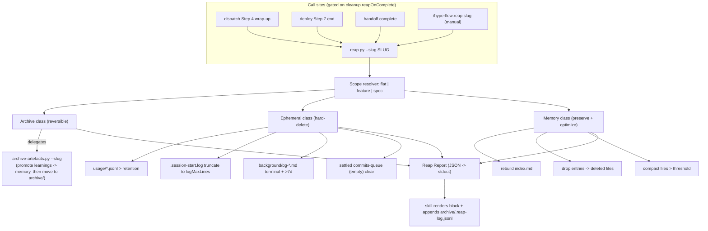

# Post-Completion Reap

## Status

| Field | Value |
|---|---|
| Status | spec-ready |
| Slug | `post-completion-reap` |
| Type | feature (subsystem) · flat task |
| Complexity | complex |
| Scope | system-wide (scripts + config + 4 skills + doctrine + tests) |
| Risk | reversible (archive-first); deletion paths are the sharp edge |
| Specialists | `architect, backend-reviewer, devops-reviewer, security-reviewer, docs` |

## TL;DR

When a task's lifecycle truly ends, Hyperflow should garbage-collect that task's *entire* scope — task file, brief dir, viewer JSON twin, draft specs, feature tree, and its ephemeral session leftovers — in one deliberate pass, then report what it removed. A cleanup engine already exists (`archive-artefacts.py`) but it is mtime-driven, session-start-triggered, blind to completion, and leaks orphans (brief dirs, JSON twins, `*.draft.md`, unbounded `usage/*.jsonl` + `.session-start.log`). This feature adds a **scope-aware "reap" phase** — archive-first, memory-preserving — that fires automatically at every lifecycle terminus (dispatch wrap-up, deploy end, handoff `complete`) and is also a standalone `/hyperflow:reap <slug>` command.

## Components

| Component | Kind | Responsibility |
|---|---|---|
| `scripts/reap.py` | new | Scope-aware reaper: resolve a slug's full artefact scope, dispose each class per policy, emit a JSON report. Idempotent, `--dry-run`. |
| `scripts/archive-artefacts.py` | extend | Add directory-aware archival (brief dirs), JSON-twin collection, and a `--slug` targeted mode reused by `reap.py` (single source of truth for archive+promote). |
| `config/schema.json` + `config/defaults.json` | extend | First-class `cleanup` block — legalizes existing `auto/staleDays/pruneDays` (currently unschema'd) + adds `reapOnComplete`, `usageRetentionDays`, `logMaxLines`, `dryRun`. |
| `skills/reap/SKILL.md` | new | `/hyperflow:reap <slug>` command + the reusable reap-phase contract the lifecycle skills call + report rendering. |
| dispatch / deploy / handoff | wire | Invoke the reap phase at each terminal step, gated on `cleanup.reapOnComplete`. |
| DOCTRINE + references | docs | Describe reap-on-completion, the disposition policy, and what is preserved. |

## §1 Architecture

`reap` is one reusable phase with three automatic call-sites and one manual entry. It does **not** re-implement archival — it composes the existing engine (`archive-artefacts.py` for archive+learning-promotion), the existing memory primitives (`memory-index.py` rebuild, orphaned-ref prune), and the existing ephemeral GC (background/usage/log retention) behind a single slug-scoped orchestrator that produces one report.



**Disposition classes** (the core policy table):

| Class | Members (for `<slug>`) | Disposition |
|---|---|---|
| Archive (reversible) | `tasks/<slug>.md`, `tasks/<slug>/` brief dir, `specs/<slug>.md`, `specs/<slug>.draft.md`, `features/<slug>/` tree, `artefacts/*/<slug>.json` twins | promote learnings → durable memory, then **move** to `.hyperflow/archive/<type>/YYYY-MM/` |
| Ephemeral (hard-delete) | `usage/*.jsonl` older than `usageRetentionDays`, `.session-start.log` beyond `logMaxLines`, `background/bg-*.md` terminal & >7d, an **empty/settled** `commits-queue/` | delete outright (regenerable / disposable) |
| Preserve + optimize | `memory/*.md` durable (`learnings/decisions/patterns/conventions/anti-patterns/project-decisions`) | **never delete**; rebuild `index.md`, refresh `session-context.md`, drop refs to now-deleted files, compact files over `memory.compactionThreshold` |
| Never touch | `.version`, `.last-cleanup`, active `commits-queue`, in-flight tasks/features, `.hyperflow-handoff` (owned by handoff `complete`) | skip |

## §2 Data flow

```mermaid
sequenceDiagram
    participant LC as Lifecycle skill
    participant Reap as reap.py --slug S
    participant AA as archive-artefacts.py --slug S
    participant Mem as memory primitives
    participant FS as .hyperflow filesystem
    LC->>Reap: reap(S) [cleanup.reapOnComplete && not dryRun]
    Reap->>Reap: resolve scope(S) -> {archive[], ephemeral[], memory-ops}
    Reap->>AA: archive+promote(S)  (only if terminal state confirmed)
    AA->>Mem: promote Learnings/Decisions -> durable *.md
    AA->>FS: move artefacts -> archive/<type>/YYYY-MM/
    Reap->>FS: hard-delete ephemeral (usage>ret, log>max, bg terminal, empty queue)
    Reap->>Mem: rebuild index, drop orphaned refs, compact oversized
    Reap-->>LC: Reap Report {archived[], deleted[], bytesFreed, memory{...}, dryRun}
    LC->>FS: append archive/.reap-log.jsonl ; print report block
```

Reap only advances a slug's artefacts to the archive **after** confirming a terminal state: flat task status `complete`/`completed`, feature `feature.md` Status `completed`, or an explicit manual invocation. Non-terminal or unknown slugs are a no-op with a reported reason (never a silent delete).

## §3 Key decisions

1. **Extend the existing engine, don't fork it.** `reap.py` delegates archive+learning-promotion to `archive-artefacts.py` via a new `--slug` mode, so there is exactly one implementation of "promote learnings then move to archive/." The daily session-start sweep stays as the mtime-based safety net for artefacts that were never explicitly reaped.
2. **Archive-first is the safety contract.** Meaningful artefacts are *moved*, never deleted; ephemeral/regenerable data is hard-deleted. This makes an accidental reap fully recoverable from `.hyperflow/archive/`.
3. **Memory is preserved by design.** Durable learnings are the record that *makes deleting the task safe* — reap optimizes memory (index rebuild, orphaned-ref prune, compaction) but never removes a durable entry. (Task-scoped durable pruning was explicitly rejected.)
4. **Idempotent + dry-run.** Reaping an already-reaped slug is a no-op. `--dry-run` (and `cleanup.dryRun`) report the plan without mutating. Auto-runs honor `cleanup.reapOnComplete`.
5. **Path safety.** Slug is validated against `[a-z0-9-]+`; every target path is resolved and asserted to live under `.hyperflow/` (or `.hyperflow-handoff/` for handoff) before any delete/move — no traversal, no deletion outside the cache.
6. **Report is a first-class output.** Every reap emits a structured report (rendered block + `archive/.reap-log.jsonl` ledger) so "show what was cleaned" is guaranteed, auto or manual.

**Trade-offs accepted:** archive/ grows until the existing `pruneDays` sweep collects it (bounded, acceptable). Memory provenance is only partial today, so task-scoped memory GC is deliberately out of scope. **Rejected:** a standalone parallel cleanup engine (duplication); hard-delete-everything (irreversible); touching `.hyperflow-handoff` outside handoff's own `complete`.

## §4 Edge cases

- Slug resolves to nothing → no-op, report `nothing to reap`.
- Task not in terminal state on an auto-run → skip with reason; manual run may `--force` after a printed warning.
- Feature partially complete (some phases pending) → do **not** archive the tree; reap only unambiguously-finished ephemera.
- `viewer.enabled=false` → no JSON twins exist; twin collection is a no-op.
- Concurrent session-start sweep → both are idempotent and archive-move is atomic (`os.replace`); a name clash appends a numeric suffix.
- `commits-queue` still has an unflushed manifest → never cleared (recovery data); only an empty/settled queue is removed.
- Reap invoked mid-dispatch (task still in-progress) → refused (non-terminal).
- Missing `cleanup` config → fall back to script `DEFAULTS`; schema addition prevents validation failure for users who set it.

## §5 File structure

```
scripts/
  reap.py                      # NEW — scope-aware reaper + report
  archive-artefacts.py         # EXTEND — dir-aware, JSON-twin, --slug mode
config/
  schema.json                  # EXTEND — cleanup block
  defaults.json                # EXTEND — cleanup defaults (opinionated only)
skills/
  reap/SKILL.md                # NEW — /hyperflow:reap + reap-phase contract
  dispatch/SKILL.md            # WIRE — Step 4 calls reap phase
  deploy/SKILL.md              # WIRE — Step 7 calls reap phase
  handoff/SKILL.md             # WIRE — complete calls reap phase
  hyperflow/DOCTRINE.md        # DOCS — Layer 10 reap-on-completion
  hyperflow/task-tracking.md   # DOCS — reap lifecycle
  hyperflow/feature-phases.md  # DOCS — feature reap
  hyperflow/memory-system.md   # DOCS — preservation policy
tests/
  test_reap.py                 # NEW — scope/disposition/idempotency/dry-run
  test_archive_artefacts.py    # EXTEND — dir + twin + --slug
docs/orchestration.md          # DOCS — cleanup config reference
CHANGELOG.md                   # DOCS
<plugin manifests> + README.md # register the reap skill
```
