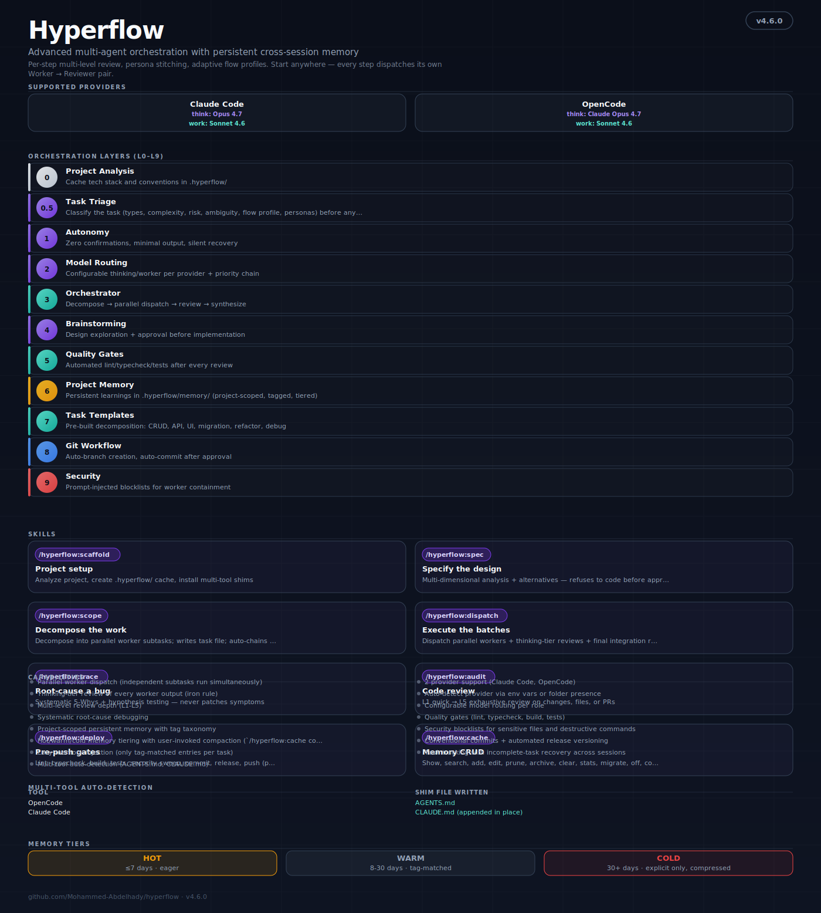

<p align="center">
  <picture>
    <source media="(max-width: 600px)" srcset="docs/assets/hero-vertical.svg" />
    
  </picture>
</p>

<h1 align="center">Hyperflow</h1>

<p align="center">
  <strong>Multi-agent orchestration for Codex App/CLI, Claude Code, OpenCode &amp; Antigravity.</strong><br/>
  Thinking models plan and review every step. Worker models execute in parallel. Learnings persist in local, per-project memory.
</p>

<p align="center">
  <code>plan</code> → <code>dispatch</code> → <code>audit</code> → <code>deploy</code><br/>
  Start anywhere. Auto-advance forward. Memory persists across sessions.
</p>

<p align="center">
  
  &nbsp;
  
  &nbsp;
  
  &nbsp;
  
</p>

<p align="center">
  <a href="https://mohammed-abdelhady.github.io/hyperflow/">Landing site</a> &middot;
  <a href="docs/installation.md">Installation</a> &middot;
  <a href="docs/orchestration.md">Orchestration</a> &middot;
  <a href="CHANGELOG.md">Changelog</a>
</p>

---

## What makes it different

Not just another orchestrator — three things set Hyperflow apart:

- **Every step is reviewed.** Worker → Reviewer is an iron rule at every granularity, sub-phases included. No worker output ships unreviewed.
- **Memory that's yours.** Learnings, decisions, and pitfalls persist in `.hyperflow/memory/` — plain markdown, committed with your repo, never uploaded, never mixed across projects. Hot/warm/cold tiering keeps injection cheap.
- **Depth that adapts.** Triage classifies every task and picks a flow profile (fast → scientific), so a 5-line fix never triggers a 300k-token deep run.
- **Compaction at the right boundary.** Automatic context compaction is held until dispatch reaches its end-of-chain gate, then checks estimated transcript usage and snapshots task state before compacting.

Underneath: a structural role separation (decision agents plan & review, workers execute — all on your session model), 15 persona-stitched experts, intent auto-routing, and host-agnostic dispatch — all local, no daemon.

## The chain

Start with a rough idea — the pipeline carries it to shipped. Start at any entry point; the orchestrator picks up and runs forward.

| # | Skill | What it does |
|---|-------|--------------|
| 1 | `plan` | **Front door** — sharpen the prompt (persona standards + 8-dim rubric), design the approach (multi-dimensional analysis + alternatives, refuses to code before you approve), and decompose it into a parallel task graph; skips whichever phase the request doesn't need |
| 2 | `dispatch` | Fan out persona-stitched workers under per-batch + final-integration review |
| 3 | `workflow` | Big-task lane — native Claude Code workflows, custom Codex/OpenCode adapter |
| 4 | `audit` | L1–L5 review on the result |
| 5 | `deploy` | Pre-push gates (lint · typecheck · build · tests · security) → commit → release → push |

`plan → dispatch` auto-chains; `audit` and `deploy` are gates that fire at the end. Enter at `plan` for anything from a rough idea to a clear task — it bounces straight to decomposition when the approach is already clear — or at `dispatch` when a task file already exists. `scaffold` is a one-time project setup — run it once per repo to build the `.hyperflow/` cache.

`workflow` is the big-task lane. Hyperflow routes deep/scientific/system-wide work, large migrations, repo-wide audits, and high-confidence verification prompts to `/hyperflow:workflow`. In Claude Code v2.1.154+, it asks the native dynamic workflow runtime to create a background workflow with research, parallel execution, adversarial verification, quality gates, and final synthesis. In Codex and OpenCode, it runs the same phases through a portable workflow adapter using provider subagents/tasks when available and inline worker/reviewer phases otherwise.

In Codex App/CLI, `/hyperflow:*` entries are treated as plugin skill aliases, not native host slash commands. If the host does not expose Hyperflow's `AskUserQuestion` popup UI, required gates still fire as concise `Hyperflow Question` chat blocks with numbered choices, then Hyperflow waits for your answer. When Codex subagents are available, Hyperflow maps worker/searcher/writer dispatches to them; otherwise those phases run inline and the chain continues in the same thread.

## Quick start

```bash
claude plugin marketplace add Mohammed-Abdelhady/hyperflow
claude plugin install hyperflow@hyperflow-marketplace
```

Codex App/CLI:

```bash
codex plugin marketplace add Mohammed-Abdelhady/hyperflow
codex plugin add hyperflow@hyperflow-marketplace
```

First initialize the project (once), then invoke any skill:

```text
/hyperflow:scaffold                                        # first: set up the project (once per repo)
/hyperflow:plan "add user auth with login + middleware"    # sharpen → design → decompose → dispatch
/hyperflow:workflow "large migration across the repo"      # big-task workflow lane
/hyperflow:trace "tests fail after the auth refactor"      # root-cause a bug
/hyperflow:deploy                                          # pre-push gates + ship
```

Codex-safe equivalent:

```text
hyperflow scaffold
hyperflow plan "add user auth with login + middleware"
hyperflow workflow "large migration across the repo"
hyperflow trace "tests fail after the auth refactor"
```

Auto-routing is on by default — say "audit the diff" or "debug this test" and the right skill runs without the `/hyperflow:*` prefix.

Setup and host notes → [Installation](docs/installation.md).

## How it works

Invoke a skill. Chain-starters auto-advance through the rest — no always-on orchestrator, no background process, everything in your terminal.

### Role separation

The separation is structural, not a setting — each role does only what it's best at. **Every agent runs on your current session model** (whatever the host uses); roles differ by responsibility, not by model.

| Role | Does |
|------|------|
| **Orchestrator** | Coordinate workers, sequence dispatches, manage chain state |
| **Decision agent** | Triage, brainstorm, decide, review every output, run the final integration pass |
| **Worker** | Execute in parallel — implement, search, write |

### Review at every granularity

Worker → Reviewer is an iron rule. Independent sub-tasks fan out in parallel; each worker feeds its own reviewer before the batch advances. Every non-trivial phase decomposes into named sub-phases (`2a`, `2b`, `2c`…), each with its own reviewer. Per-batch reviewers do L1–L2 spot-checks; a final integration reviewer runs once over the cumulative diff. Each reviewer returns a verdict — `APPROVE` or `NEEDS_REVISION` (retry once with findings injected).

Reviews and investigations are run by **domain specialists**, not a generic reviewer — see below.

### Specialist registry + Brain

Beyond the personas, Hyperflow ships a registry of **named, domain-specialized agents** in [`agents/`](agents/) — dispatched as the right reviewer/investigator for each surface instead of one generic role:

- **Reviewers** — `architect` (system decomposition, boundaries, data flow & frontend-at-scale; designs at plan time and reviews structural change), `designer` (design system, visual/experiential design, prior-art research & anti-slop; designs at plan time and reviews UI change), `frontend-reviewer`, `backend-reviewer`, `api-reviewer`, `database-reviewer`, `security-reviewer`, `vulnerability-reviewer`, `devops-reviewer`, `performance-reviewer`, `algorithm-reviewer` (Big-O & data-structure complexity), `accessibility-reviewer`, `mobile-reviewer`, `data-ml-reviewer`, `compliance-reviewer`.
- **Investigators** — `searcher`, `debugger`, `analyst`, `researcher`.
- **Brain** — a decision-agent router consulted once after triage that decides *which* specialists are responsible, then writes that roster into the artefact so the whole chain inherits it. `plan` announces the responsible specialists; `dispatch`/`audit`/`trace`/`deploy` dispatch them.

Each specialist **binds** the matching persona for its standards and adds a strict charter, a **web-research-first** step (it looks up current best-practices / CVEs / framework docs before judging — on `deep`/`research`/`scientific`/`security` flows), and authority to fan out depth-capped sub-agents. Specialists run on the current session model like every other agent — they specialise the *role*, not the model. See [`agents/README.md`](agents/README.md).

### Triage picks the depth

Every task is classified — complexity, scope, risk, ambiguity — and assigned a flow profile, so effort matches the work instead of always running deep:

| Profile | Use when | Workers | Budget |
|---------|----------|---------|--------|
| `fast` | trivial single-file, reversible | 1 | ≤30k |
| `standard` | simple/moderate, 2–5 files | 1–2 | ≤100k |
| `deep` | complex / cross-cutting / system-wide | 3+ | 300k |
| `research` | unknown territory, evaluation | 3+ searchers | ≤80k |
| `creative` | UI/UX exploration | 1–2 | ≤150k |
| `scientific` | correctness-critical, proof work | 2–3 + TDD | 300k |

### Persona stitching

15 composable expert personas — architect, api, db, frontend, ui, security, performance, scientific, refactor, bugfix, test, research, creative, devops, docs. Each task is tagged and the matching personas are stitched into the worker prompt in priority order: `security` frames every decision first, `creative` adapts last.

### Tasks, or features with phases

Small work is decomposed into a single flat task file (`.hyperflow/tasks/<slug>.md`). Work large enough to split into **sequential stages** becomes a **feature** — a self-contained folder whose **phase sub-folders** each encapsulate everything for that phase: its own `tasks/`, plus `spec.md` (design), `research.md` (findings), and `decisions.md` (ADRs + learnings that roll up to memory when the phase completes).

```
.hyperflow/features/checkout-redesign/
  feature.md                    # status · phase roster · dependency graph
  phase-1-data-layer/  phase.md · tasks/ · spec.md · research.md · decisions.md
  phase-2-api/         phase.md · tasks/ · …
  phase-3-ui/          phase.md · tasks/ · …
```

Phases run in dependency order; the tasks inside a phase run in parallel batches as usual. `plan` picks flat-vs-feature during decomposition; `dispatch` executes phase by phase; `/hyperflow:status` shows per-phase progress. See [`skills/hyperflow/feature-phases.md`](skills/hyperflow/feature-phases.md).

### One session, or two

At the start of a chain you choose **how** to run it (this replaces the old auto/manual gate):

- **One session** — plan, build, and review all here, straight through.
- **Two sessions** — this session plans (brain routing + `plan`), then **stops at the dispatch boundary** and writes a **git-committed handoff package** (`.hyperflow-handoff/<slug>/`). A second session in another environment — Codex, Gemini/Antigravity, OpenCode, even another machine — runs `/hyperflow:dispatch <slug>` to build, then either deploys or returns the diff for review. You come back to the first session and `/hyperflow:audit` the build. The Brain-decided specialist roster, triage, and chain args all travel inside the package. Manage the lifecycle with `/hyperflow:handoff` (`list` / `status` / `pickup` / `review` / `complete`). See [`skills/hyperflow/session-handoff.md`](skills/hyperflow/session-handoff.md).

For multi-phase features, `/hyperflow:dispatch` also asks whether to build **all phases** straight through or **phase by phase** (stop after each phase for review).

### Workflows for big tasks

Hyperflow routes very large tasks to `/hyperflow:workflow` instead of forcing everything through turn-by-turn dispatch. Use it for system-wide changes, large migrations, repo-wide audits, and verification-heavy work.

In Claude Code, the skill uses native dynamic workflows. This requires Claude Code v2.1.154+ with workflows enabled; workflows can be disabled by `/config`, managed settings, `~/.claude/settings.json`, or `CLAUDE_CODE_DISABLE_WORKFLOWS=1`. Hyperflow does not set `/effort ultracode` or `xhigh` automatically. Use `/effort ultracode` yourself if you want Claude Code's session-wide automatic workflow selection.

In Codex and OpenCode, the same command runs a custom Hyperflow workflow adapter: research and planning, provider subagents/tasks or inline worker phases, adversarial verification, quality gates, per-task commits, and final synthesis. This is not native Claude-style saved workflow support; repeatability comes from the skill, `.hyperflow/tasks/`, memory, and provider-specific subagent/task configuration.

## Memory that persists

Learnings live at `.hyperflow/memory/` — plain markdown, committed with your repo, **never uploaded, never mixed across projects**.

- **Three tiers** — `hot` (≤7 days, always injected), `warm` (8–30 days, tag-matched), `cold` (30+ days, on-demand, compressed).
- **Lazy injection** — only tag-matched entries load for a given task, so injection cost stays bounded.
- **Auto-written by the chain** — `audit` records recurring findings to `anti-patterns.md` (hot); `plan` records structural answers to `project-decisions.md`, so the same questions aren't asked twice.

Full walkthrough → [Orchestration](docs/orchestration.md) · [Landing site](https://mohammed-abdelhady.github.io/hyperflow/).

## Skills

Fourteen skills. One chain-starter auto-advances through the chain; the rest are standalone. Auto-routing is on by default — say the verb and the right skill runs without the `/hyperflow:*` prefix. In Codex, `hyperflow <skill>` is the safest portable spelling, with `/hyperflow:*` handled as an alias.

| Skill | Command | Type | Purpose |
|-------|---------|------|---------|
| `plan` | `/hyperflow:plan` | Chain starter | Sharpen the prompt (8-dim rubric), design the approach (analysis + alternatives), and decompose into a parallel task graph; auto-chains to dispatch |
| `dispatch` | `/hyperflow:dispatch` | Endpoint | Fan out persona-stitched workers under per-batch + final review |
| `design` | `/hyperflow:design` | Standalone | Domain-grounded design system + prior-art research + local taste skills, anti-slop; hands off to the build chain |
| `workflow` | `/hyperflow:workflow` | Big-task lane | Native Claude Code workflows; custom Codex/OpenCode adapter for migrations, audits, and verification-heavy work |
| `scaffold` | `/hyperflow:scaffold` | Standalone | Project setup — `.hyperflow/` cache + multi-tool shims |
| `trace` | `/hyperflow:trace` | Standalone | Systematic root-cause debugging — 5 Whys, never patches symptoms |
| `audit` | `/hyperflow:audit` | Standalone | L1 quick → L5 exhaustive review on changes, files, or PRs |
| `deploy` | `/hyperflow:deploy` | Standalone | Pre-push gates → commit → release → push (push always asks) |
| `cache` | `/hyperflow:cache` | Standalone | Memory CRUD — show, search, add, prune, archive, compact |
| `handoff` | `/hyperflow:handoff` | Standalone | Two-session handoff — list / status / pickup / review / complete a committed package |
| `status` | `/hyperflow:status` | Standalone | Read-only snapshot — version, memory count, live per-task progress |
| `background` | `/hyperflow:background` | Standalone | List, show, cancel, prune task-level background agents |
| `sticky` | `/hyperflow:sticky` | Standalone | `on` / `auto` / `off` — per-project auto-routing mode |
| `bridge` | `/hyperflow:bridge` | Standalone | Embed the portable doctrine into `CLAUDE.md` for Desktop / web / IDE |
| `flush` | `/hyperflow:flush` | Standalone | Flush a deferred-commit queue from a prior or crashed chain |

## Providers

Hyperflow runs on whatever model your agent session uses — Claude Code, Codex, OpenCode, Antigravity, or any other host. Every dispatched agent inherits the current session model; there is no model configuration and nothing to set up. Roles (orchestrator, decision agent, worker, reviewer) differ by responsibility, not by model.

## Documentation

- [Landing site](https://mohammed-abdelhady.github.io/hyperflow/) — the full overview
- [Installation](docs/installation.md) · [Orchestration](docs/orchestration.md)
- [Changelog](CHANGELOG.md) · [Privacy](PRIVACY.md) · contributor guide in [`CLAUDE.md`](CLAUDE.md)

## License

MIT
